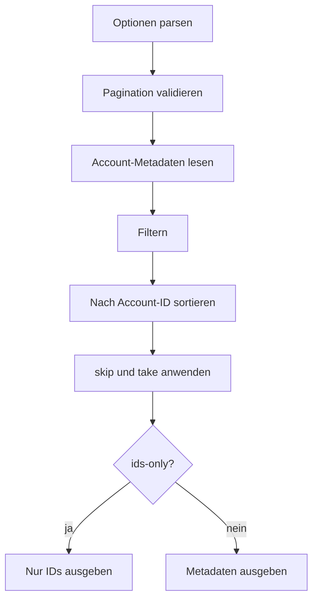

# `authy accounts list`

## Funktion und Bedienung

Listet gespeicherte Account-Metadaten in stabiler Reihenfolge nach Account-ID.

```text
authy accounts list [--skip <n>] [--take <n>] [--filter <text>] [--ids-only]
```

| Option | Wirkung |
| --- | --- |
| `--skip <n>` | Überspringt `n` Ergebnisse; Standard `0`. |
| `--take <n>` | Begrenzt die Rückgabe; Standard `25`, mindestens `1` bis zum konfigurierten Maximum. |
| `--filter <text>` | Filtert nicht geheime Metadaten nach Account-ID oder Anzeigename. |
| `--ids-only` | Gibt nur Account-IDs statt vollständiger Metadaten aus. |

Die Ausgabe enthält `total`, `skip` und `take`. Ein Docker-Daemon ist nicht
erforderlich.

## Interner Ablauf

Die CLI parst die Optionen. Das Repository liest `accounts.json`, validiert
Pagination, filtert und sortiert die Metadaten. Bei `--ids-only` reduziert die
CLI nur die Darstellung des Resultats.


