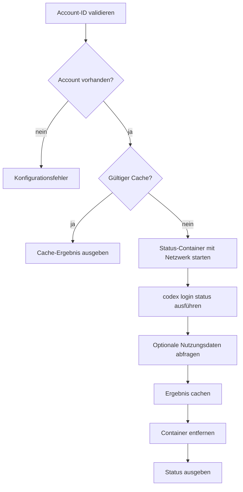

# `authy accounts status`

## Funktion und Bedienung

Fragt Codex-Anmeldestatus sowie optionale Nutzungs- und Rate-Limit-Daten eines
gespeicherten Accounts ab.

```text
authy accounts status --account-id <id>
```

| Option | Wirkung |
| --- | --- |
| `--account-id <id>` | Erforderliche, validierte ID des zu prüfenden Accounts. |

Die Antwort enthält `subscription`, `checkedAt`, `cached` sowie optionale
Token- und Rate-Limit-Daten. Optionale Werte können `null` sein.

## Interner Ablauf

Die Engine prüft den Account und verwendet zunächst ihren Status-Cache. Bei
einem Cache-Miss startet der Gateway einen temporären Container mit Netzwerk,
führt `codex login status` aus und fragt danach optionale Nutzungsdaten ab. Das
Ergebnis wird gecacht und der Container entfernt.


