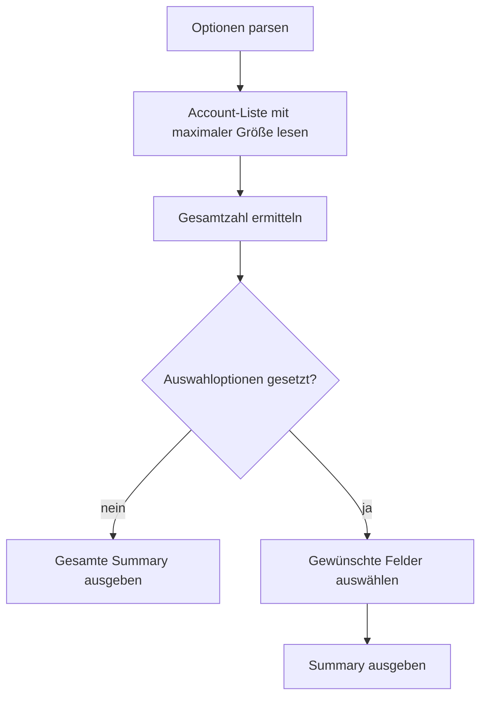

# `authy accounts summary`

## Funktion und Bedienung

Liefert zusammenfassende Metadaten zu gespeicherten Accounts.

```text
authy accounts summary [--count] [--active-account-id]
```

| Option | Wirkung |
| --- | --- |
| `--count` | Beschränkt die Ausgabe auf die Anzahl der Accounts. |
| `--active-account-id` | Fordert eine aktive Account-ID an, sofern die Engine sie bereitstellt. |

Ohne Optionen liefert der Befehl alle verfügbaren Summary-Felder. Die aktuelle
Engine liefert nur `count`; eine aktive Account-ID wird noch nicht ermittelt.

## Interner Ablauf

Die Engine liest die Account-Liste mit der maximal konfigurierten Seitengröße
und übernimmt deren Gesamtzahl. Die CLI wählt bei Optionen nur die angeforderten
Felder aus und gibt das JSON-Ergebnis aus.


