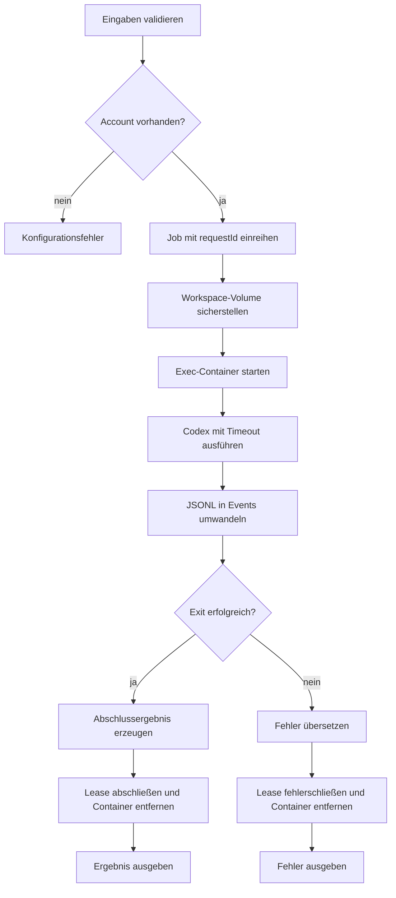

# `authy exec`

## Funktion und Bedienung

Führt einen Codex-Task mit einem gespeicherten Account aus. Der Workspace des
Accounts bleibt als Docker-Volume erhalten; der Ausführungscontainer ist
kurzlebig.

```text
authy exec --account-id <id> --prompt <text> [--detail-level <level>] [--timeout-ms <n>]
```

| Option | Wirkung |
| --- | --- |
| `--account-id <id>` | Erforderliche, validierte Account-ID. |
| `--prompt <text>` | Erforderlicher Codex-Auftrag mit 1 bis 100000 Zeichen. |
| `--detail-level <level>` | `verbose`, `internal`, `turns` oder `end`; Standard `end`. Legt die ausgegebenen Codex-Ereignisse fest. |
| `--timeout-ms <n>` | Positives Zeitlimit in Millisekunden; sonst gilt der konfigurierte Standard. |

Bei `end` enthält das Ergebnis den finalen Text; unabhängig vom Detail-Level
enthält die Abschlussantwort auch `requestId`, Account-ID und Exit-Code. Andere
Detail-Stufen liefern zusätzlich strukturierte Ereignisse.

## Interner Ablauf

Die Engine validiert Eingaben und reiht den Job mit `requestId` in die
Account-Queue ein. Der Gateway stellt das Workspace-Volume sicher, startet einen
Container, führt Codex mit Timeout aus und wandelt JSONL nach Detail-Level in
Engine-Ereignisse um. Lease und Container werden in jedem Pfad beendet.


