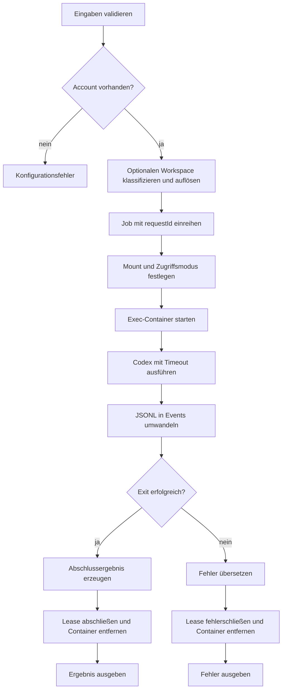

# `authy exec`

## Funktion und Bedienung

Führt einen Codex-Task mit einem gespeicherten Account in einem kurzlebigen
Container aus. Dateizugriff wird für jeden Aufruf explizit gewählt.

```text
authy exec --account-id <id> --prompt <text> [--workspace <url>] [--readonly] [--detail-level <level>] [--timeout-ms <n>]
```

| Option | Wirkung |
| --- | --- |
| `--account-id <id>` | Erforderliche, validierte Account-ID. |
| `--prompt <text>` | Erforderlicher Codex-Auftrag mit 1 bis 100000 Zeichen. |
| `--detail-level <level>` | `verbose`, `internal`, `turns` oder `end`; Standard `end`. Legt die ausgegebenen Codex-Ereignisse fest. |
| `--timeout-ms <n>` | Positives Zeitlimit in Millisekunden; sonst gilt der konfigurierte Standard. |
| `--workspace <url>` | Lokaler Verzeichnispfad oder `file://`-URL. Bind-Mount unter `/workspace`, standardmäßig lesbar und schreibbar. |
| `--readonly` | Workspace als Docker-Mount und Codex-Sandbox schreibgeschützt. Ohne Workspace bleibt Dateizugriff deaktiviert. |

```sh
authy exec --account-id ada --prompt "Beantworte eine Frage"
authy exec --account-id ada --prompt "Passe den Code an" --workspace ./projekt
authy exec --account-id ada --prompt "Prüfe den Code" --workspace "file:///C:/Projects/mein%20projekt" --readonly
```

Ohne `--workspace` wird kein Workspace eingebunden oder angelegt. Lokale
Shell-/Exec-, Patch-, JavaScript-, Unteragenten- und Bild-Dateitools werden
deaktiviert; Codex verwendet eine Read-only-Sandbox. Codex selbst benötigt
weiterhin Laufzeitdateien und Anmeldedaten im Container. Jeder Aufruf verwendet
ein temporäres `CODEX_HOME` mit ausschließlich kopierten Anmeldedaten, sodass
gespeicherte Account-Konfiguration oder MCP-Tools keinen Dateizugriff ergänzen.
Von Codex erneuerte Anmeldedaten werden nach dem Aufruf atomar zurückgespeichert.
Der Exec-Prozess läuft als `authy`; Sandbox-Eskalationen werden nie genehmigt.
Die Codex-Schalter richten sich nach der [offiziellen Konfigurationsreferenz](https://developers.openai.com/codex/config-reference/).

Mit Workspace bleiben Änderungen direkt im angegebenen Hostverzeichnis erhalten.
Absolute und relative lokale Pfade sowie URL-kodierte Dateipfade werden
unterstützt. Relative Pfade beziehen sich auf das Arbeitsverzeichnis des
Authy-Prozesses; beim API-Backend ist dies der Server. Ein vorgeschalteter
Classifier erkennt das URL-Schema und wählt den registrierten Resolver aus.
Initial ist nur `file` registriert; andere Schemata, Netzwerkpfade, fehlende
Verzeichnisse und einzelne Dateien ergeben `INVALID_USAGE` (CLI-Exit-Code `2`).
Symlinks werden vor dem Mount auf den tatsächlichen Verzeichnispfad aufgelöst.
Das Verzeichnis muss für den Docker-Daemon erreichbar sein (lokaler Docker oder
Docker Desktop). Bei einem entfernten Daemon ist ein lokaler Clientpfad kein
übertragener Workspace. Die Hostrechte müssen Zugriff für den Containerbenutzer
`authy` (UID/GID `10002`) erlauben; Authy ändert keine Host-Dateirechte.

Migration: Der frühere automatische Account-Workspace entfällt. Vorhandene
Workspace-Volumes werden nicht gelöscht oder wieder eingebunden. Für Arbeiten
an Dateien muss nun explizit `--workspace` angegeben werden.

Bei `end` enthält das Ergebnis den finalen Text; unabhängig vom Detail-Level
enthält die Abschlussantwort auch `requestId`, Account-ID und Exit-Code. Andere
Detail-Stufen liefern zusätzlich strukturierte Ereignisse.

## Interner Ablauf

Die Engine validiert Eingaben, klassifiziert und löst den optionalen Workspace
auf und reiht den Job mit `requestId` in die Account-Queue ein. Der Gateway
startet den Container mit dem gewählten Bind-Mount und Zugriffsmodus, führt Codex
mit Timeout aus und wandelt JSONL nach Detail-Level in Engine-Ereignisse um.
Lease und Container werden in jedem Pfad beendet. Das temporäre `CODEX_HOME`
wird mit dem Container entfernt; das Hostverzeichnis gehört dem Aufrufer.


