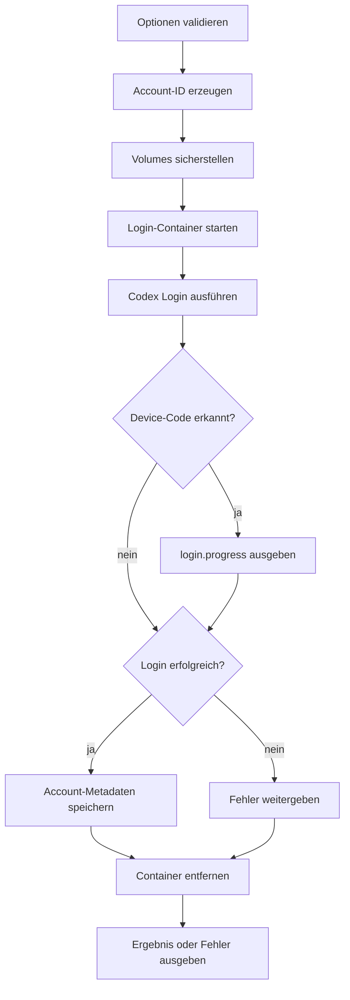

# `authy login`

## Funktion und Bedienung

Meldet einen Codex-Account an und speichert die zulässigen Auth-Daten unter
einer neu erzeugten Account-ID.

```text
authy login [--headless | --api-key-env <name>] [--display-name <name>]
```

| Option | Wirkung |
| --- | --- |
| `--headless` | Startet Device-Auth ohne Browser im Container; URL und Code werden als Ereignis ausgegeben. |
| `--api-key-env <name>` | Liest einen Schlüssel aus der benannten Umgebungsvariablen; nicht zusammen mit `--headless`. Der aktuelle Docker-Gateway unterstützt diesen Login noch nicht. |
| `--display-name <name>` | Speichert einen nicht geheimen Anzeigenamen in den Metadaten. |

Ohne Login-Option startet Codex seinen normalen Login. Bei Erfolg enthält die
Antwort die erzeugte `accountId`.

## Interner Ablauf

Die Engine prüft Optionen und gegebenenfalls die Umgebungsvariable. Der
Docker-Gateway erzeugt eine zufällige Account-ID, stellt die verwalteten Volumes
sicher, startet einen temporären Login-Container und führt `codex login` oder
`codex login --device-auth` aus. Headless-Informationen werden in ein
Fortschrittsereignis umgewandelt. Danach werden Metadaten gespeichert; der
Container wird auch bei Fehlern entfernt.


