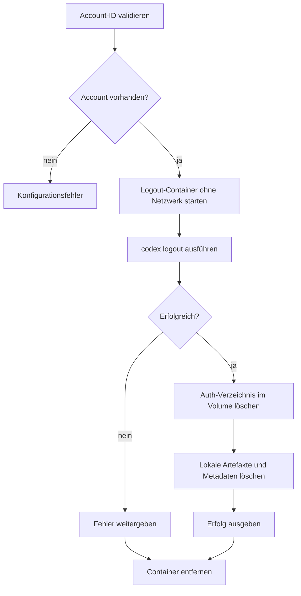

# `authy logout`

## Funktion und Bedienung

Meldet einen gespeicherten Account bei Codex ab und entfernt seine Auth-Daten
und Metadaten.

```text
authy logout --account-id <id>
```

| Option | Wirkung |
| --- | --- |
| `--account-id <id>` | Erforderliche, validierte ID des abzumeldenden Accounts. |

Die ID muss existieren. Bei Erfolg enthält die Antwort `loggedOut: true`. Der
accountbezogene Workspace wird nicht gelöscht.

## Interner Ablauf

Die Engine validiert die ID und prüft die Metadaten. Der Docker-Gateway startet
einen temporären Container ohne Netzwerk, führt `codex logout` aus und löscht
danach das Auth-Verzeichnis im Volume. Anschließend entfernt die Engine lokale
Auth-Artefakte und Metadaten. Der Container wird immer bereinigt.


