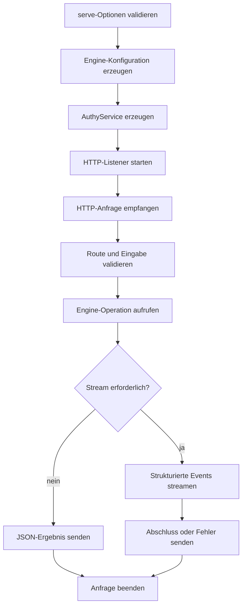

# `authy serve`

## Funktion und Bedienung

`serve` startet den HTTP-Server für die [Authy API](../backends/api.md).

```text
authy serve [--host <loopback-host>] [--port <number>]
```

Standard ist `127.0.0.1:8787`. `--host` akzeptiert ausschließlich
Loopback-Adressen (`127.0.0.1`, `::1` oder `localhost`); `--port` akzeptiert
`0` bis `65535`, wobei `0` einen freien Betriebssystem-Port auswählt. Die API
ist absichtlich nicht extern erreichbar und verwendet in v1 keine Token-Auth.

## Interner Ablauf

Die CLI erzeugt die übliche Engine-Konfiguration und den `AuthyService`. Der
API-Adapter startet einen HTTP-Listener, validiert Routen und Eingaben und
übersetzt Resultate, Fehler und Events; Docker- und Codex-Logik bleibt in der
Engine. Bei `SIGINT` oder `SIGTERM` wird der Listener geschlossen.


